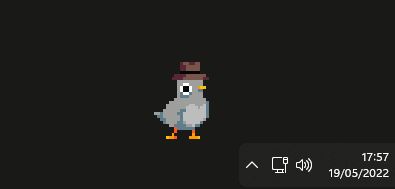

<h1 align="center">Pigeon</h1>
<h3 align="center">🐦 Cute Desktop Pigeon written in Python (only for Windows)</h3>

# 📝 Features
- 🚶 Walking
- 🍴 Eating
- 😴 Sleeping
- 🎤 Singing (requires Spotify installed)
